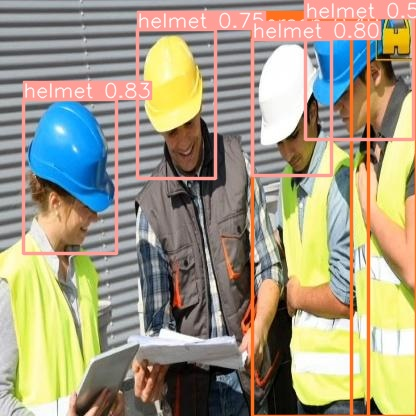
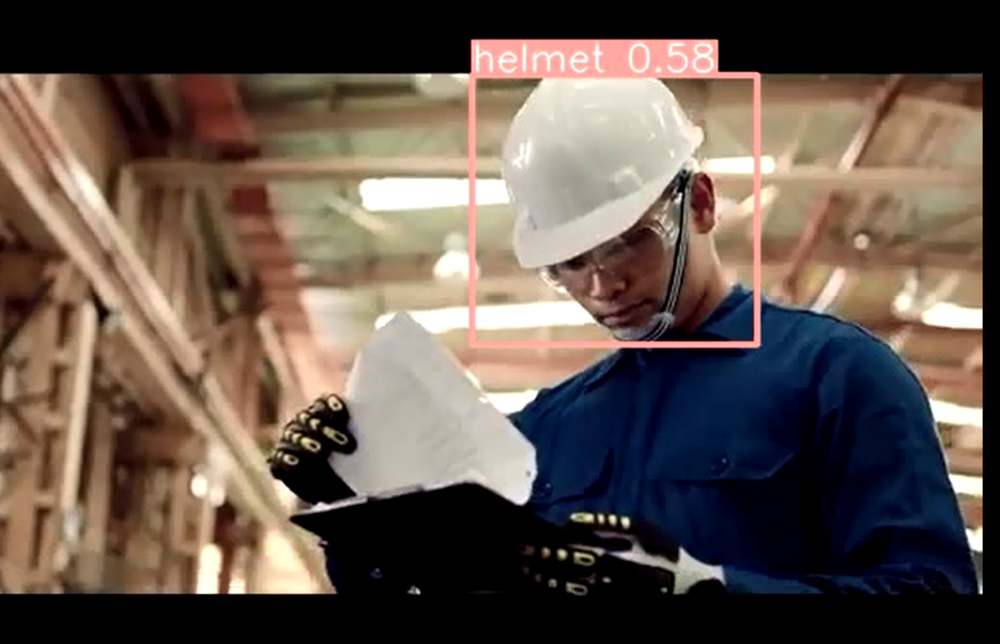

# Safety_Helmet_Detection_YOLOv10n
A simple demo app that help detect safety helmet in an image or video using YOLOv10n

## How to run
1. Download file main.ipynb
2. Open file main.ipynb in Google Colab
3. In Google Colab, change runtime type from CPU to GPU
4. Run step-by-step as below:
    * Step 01: Download and unzip "Safety_Helmet_Dataset.zip"
    * Step 02: Download source code of YOLOv10 from Github
    * Step 03: Install required libraries
    * Step 04: Download weights of pre-trained models (nano version)
    * Step 05: Initiate model
    * Step 06: Train the model
    * Step 07: Evaluate the model
    * Step 08: Predict with an image                             
        
    * Step 09: Predict with a video from youtube
        